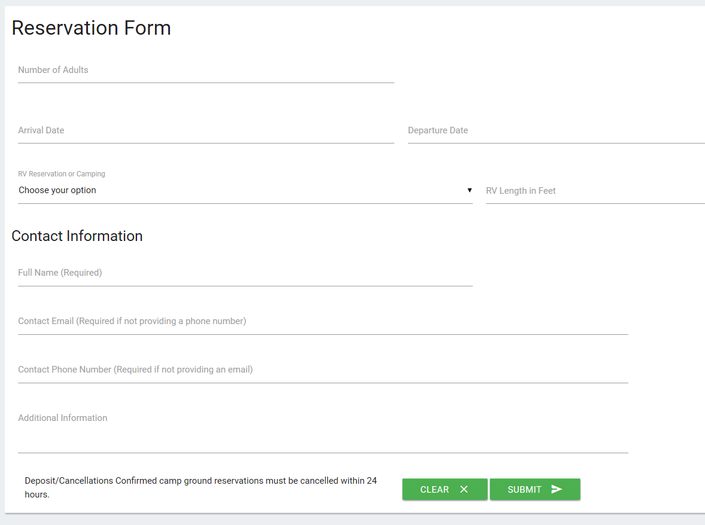
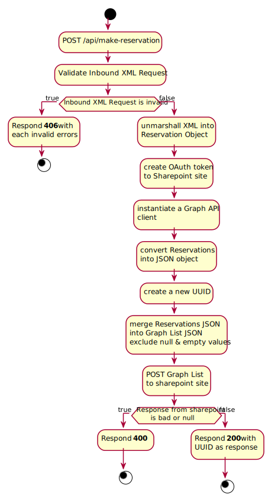

# Matsu RV Park Assets
This code is for the Matsu RV Park's reservation form input. located at [reservation site](https://www.matsurvpark.com/reservations.html).

The site is pure HTML5, Materialize CSS, and Plain javascript. requests are submitted via AJAX. Data is submitted in XML.

**All requests are submitted via HTTP POST to an Azure Function.**

## Azure Function
Azure Functions is used to process the POST requests for the site. The main purpose of this function is to handle Reservation Requests and to insert items into a sharepoint site's list.

Information | Activity Diagram
--|-----
A CORS record to allow POST requests from a different url has to be created.    Validating with an XSD inorder to protect against XSS vulnerabilities.    OAuth 2.0 was used to authorized this function to insert items in a list. **NOT** using implicit flow.   The Code for the OAuth portion was from Microsoft Developer Caitlin Russle [github](https://www.youtube.com/redirect?q=https%3A%2F%2Fgithub.com%2Fcbales%2Fonenote-content-push-java-graph-sample&v=ZnTcmiQgS08&event=video_description&redir_token=DOXtUIvDWYStXy9uyABCmYL7KhF8MTU4NDc1MjYwMUAxNTg0NjY2MjAx). also checkout this video for more information.  | 

